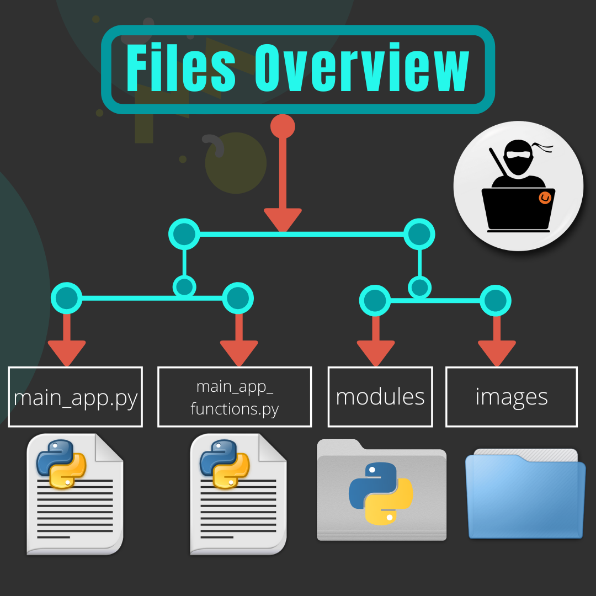

# ML Automator

## What is ML Automator?
Ml Automator is an open source web App built using Streamlit that makes life easier for Data Science Community. It helps data scientists to perform Data-Preprocessing, EDA and Model Bulding quickly and efficiently. ML Automator is a website which serves from data preprocessing to model building functionalties etc. in a super easy way.The simplicity of Ml Automator is inspired by the hectic work of performing many tasks in ML bodel building again and again!!.
ML Automator is a great web App which simplifies the machine learning tasks for data scientists.This website is helping data scientists and also helping individuals who want to start exploring the field of data science, having no prior knowledge in this field. This website is simple to use and can be used to train a ML model on a dataset very easily.

## Deployed Website Link
ML Automator is deployed Here  ----->>>  https://ml-automator.herokuapp.com/

## Steps to run web app on your Local Host
- Firstly clone the whole repo to your Local System using Following command in git bash :- 
  ``git clone https://github.com/AyushMalik/basic_ML_model_building_assistant_for_regression_and_classification_problems.git``

- move to `basic_ML_model_building_assistant_for_regression_and_classification_problems` folder

- Open cmd and type ``mkvirtualenv your_enviroment_name`` to create a seprate virtual enviroment. 

- Now to Shift to your Virtual enviroment type  ``workon your_enviroment_name``  

- Now to install all required packages for this web App type ``pip install -r requirements.txt`` in your cmd.

- Now as all the required packages are installed , type ``streamlit run main_app.py`` in your cmd.

- After this the website will start running on your Localhost. And there You go !!! 😃😃😃

## Current Contributors

## License

MIT License

Copyright (c) 2020 Ayush Malik

Permission is hereby granted, free of charge, to any person obtaining a copy of this software and associated documentation files (the "Software"), to deal in the Software without restriction, including without limitation the rights to use, copy, modify, merge, publish, distribute, sublicense, and/or sell copies of the Software, and to permit persons to whom the Software is furnished to do so, subject to the following conditions:

The above copyright notice and this permission notice shall be included in all copies or substantial portions of the Software.

THE SOFTWARE IS PROVIDED "AS IS", WITHOUT WARRANTY OF ANY KIND, EXPRESS OR IMPLIED, INCLUDING BUT NOT LIMITED TO THE WARRANTIES OF MERCHANTABILITY, FITNESS FOR A PARTICULAR PURPOSE AND NONINFRINGEMENT. IN NO EVENT SHALL THE AUTHORS OR COPYRIGHT HOLDERS BE LIABLE FOR ANY CLAIM, DAMAGES OR OTHER LIABILITY, WHETHER IN AN ACTION OF CONTRACT, TORT OR OTHERWISE, ARISING FROM, OUT OF OR IN CONNECTION WITH THE SOFTWARE OR THE USE OR OTHER DEALINGS IN THE SOFTWARE.
